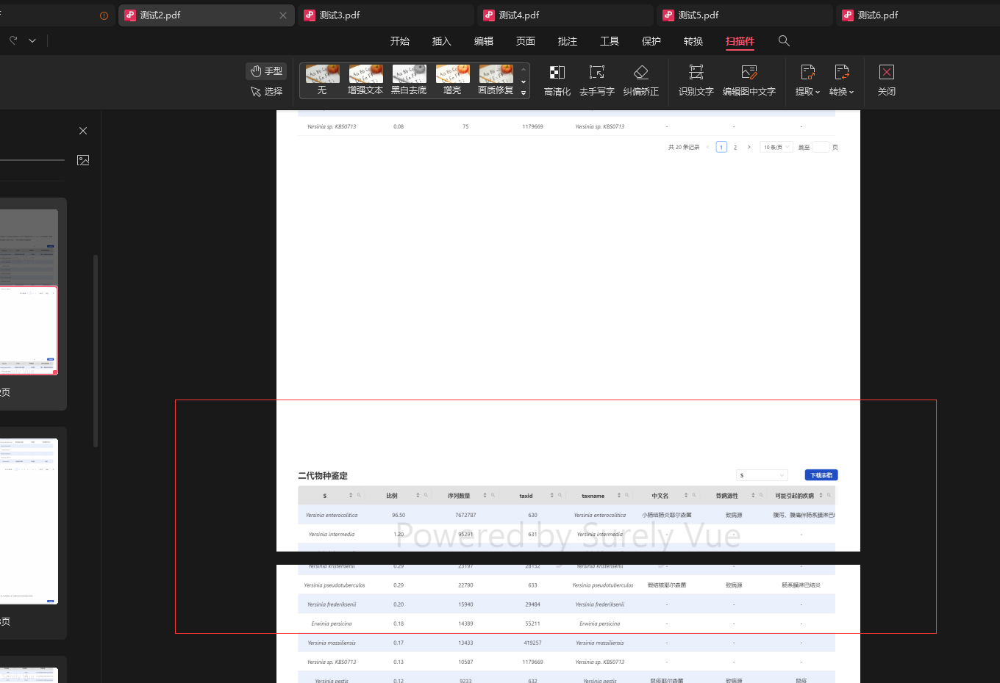
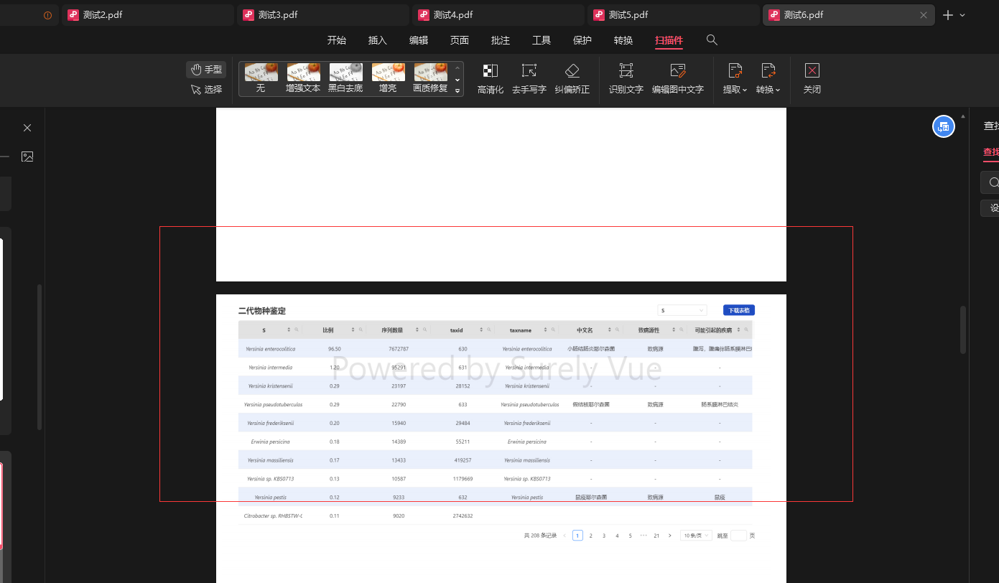

# htmlToPdf

#### 介绍
前端将html导出pdf，通过遍历dom，解决html被分页节段问题
基于jspdf html2canvas两个库封装的

* 这是借鉴了[qq_251025116](https://blog.csdn.net/qq_24882601?type=blog)大佬的解决方案并优化升级完成的，[原文链接](https://blog.csdn.net/qq_24882601/article/details/123863353?ops_request_misc=&request_id=&biz_id=102&utm_term=html%E8%BD%ACpdf%E5%88%86%E9%A1%B5%E9%97%AE%E9%A2%98%E7%BB%88%E6%9E%81%E8%A7%A3%E5%86%B3%E6%96%B9%E6%A1%88%20k-htmlpdf&utm_medium=distribute.pc_search_result.none-task-blog-2~all~sobaiduweb~default-0-123863353.nonecase&spm=1018.2226.3001.4187)

# 1.安装依赖
```js
    npm install jspdf html2canvas
```
# 2.使用方法
```js
    import htmlToPdffrom './index.js'
    const suc = () => {
	  message.success('success');
	};
    //记得在需要打印的div上面添加 id
  let dom = document.querySelector('#testPdf');
  let pdf = new htmlToPdf(dom, '测试', 'splitPages', ',', suc, 2);
  pdf.outPutPdfFn('测试');
```
# 3.使用说明
```js
 //splitPages 是需要添加的类名，需要再那个地方分页就在那个地方添加类名 splitPages
    
 //如：
         <SpeciesIdentification class="splitPages" :baseData="baseData" />

        <SpeciesIdentificationSecond class="splitPages" :baseData="baseData" />

        <RepetPic class="splitPages" :baseData="baseData" />

        <RepetTable class="splitPages" :baseData="baseData" />

        <GeneralAnnotation class="splitPages" :baseData="baseData" />
```
# 导出效果对比：
## 分页被截断

## 分页不被截断


#### 特技

1.  使用 Readme\_XXX.md 来支持不同的语言，例如 Readme\_en.md, Readme\_zh.md
2.  Gitee 官方博客 [blog.gitee.com](https://blog.gitee.com)
3.  你可以 [https://gitee.com/explore](https://gitee.com/explore) 这个地址来了解 Gitee 上的优秀开源项目
4.  [GVP](https://gitee.com/gvp) 全称是 Gitee 最有价值开源项目，是综合评定出的优秀开源项目
5.  Gitee 官方提供的使用手册 [https://gitee.com/help](https://gitee.com/help)
6.  Gitee 封面人物是一档用来展示 Gitee 会员风采的栏目 [https://gitee.com/gitee-stars/](https://gitee.com/gitee-stars/)
